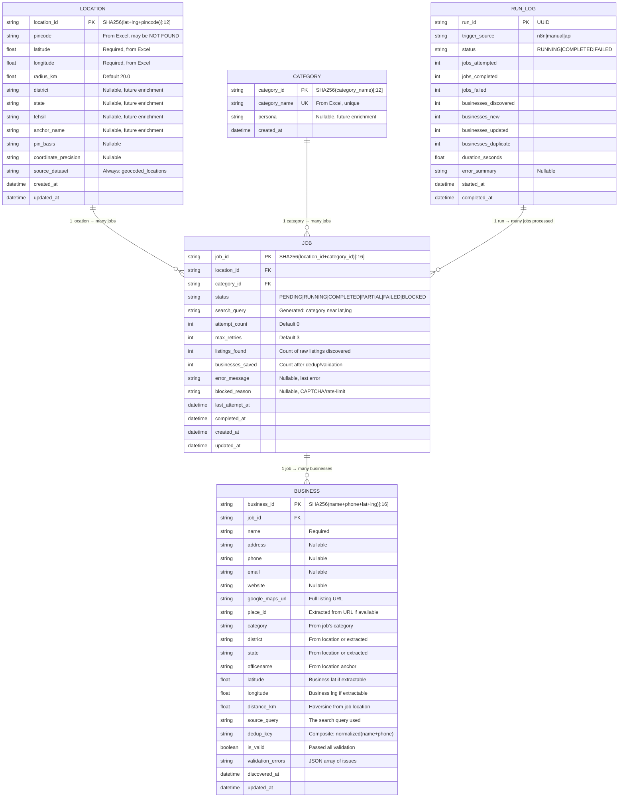

# DATA_MODEL.md — Database Schema and Models

> Version: 1.0.0 | Created: 2026-09-14 | Database: SQLite (WAL mode) via SQLAlchemy 2.0

---

## 1. Entity Relationship Diagram



---

## 2. Table Definitions

### 2.1 `locations`

Loaded from `Geocoded_Ad_Targeting_Locations_FINAL.xlsx` → Sheet1.

| Column               | Type         | Constraints        | Source           |
|----------------------|--------------|--------------------|------------------|
| `location_id`        | VARCHAR(12)  | PRIMARY KEY        | Generated hash   |
| `pincode`            | VARCHAR(10)  | NOT NULL           | Excel col A      |
| `latitude`           | FLOAT        | NOT NULL           | Excel col B      |
| `longitude`          | FLOAT        | NOT NULL           | Excel col C      |
| `radius_km`          | FLOAT        | NOT NULL DEFAULT 20.0 | Config        |
| `district`           | VARCHAR(100) | NULLABLE           | Future enrichment|
| `state`              | VARCHAR(100) | NULLABLE           | Future enrichment|
| `tehsil`             | VARCHAR(100) | NULLABLE           | Future enrichment|
| `anchor_name`        | VARCHAR(200) | NULLABLE           | Future enrichment|
| `pin_basis`          | VARCHAR(50)  | NULLABLE           | Future enrichment|
| `coordinate_precision`| VARCHAR(20) | NULLABLE           | Future enrichment|
| `source_dataset`     | VARCHAR(50)  | NOT NULL DEFAULT 'geocoded_locations' | Fixed |
| `created_at`         | DATETIME     | NOT NULL           | Auto             |
| `updated_at`         | DATETIME     | NOT NULL           | Auto             |

**Indexes:**
- PRIMARY KEY on `location_id`
- INDEX on `pincode`
- INDEX on `(latitude, longitude)`

**Row count:** 58 (current Excel)

---

### 2.2 `categories`

Loaded from `G-Map Scraper Categories.xlsx` → Sheet1.

| Column          | Type          | Constraints        | Source       |
|-----------------|---------------|--------------------|--------------|
| `category_id`   | VARCHAR(12)   | PRIMARY KEY        | Generated hash|
| `category_name` | VARCHAR(200)  | NOT NULL, UNIQUE   | Excel col A  |
| `persona`       | VARCHAR(100)  | NULLABLE           | Future enrichment|
| `created_at`    | DATETIME      | NOT NULL           | Auto         |

**Indexes:**
- PRIMARY KEY on `category_id`
- UNIQUE INDEX on `category_name`

**Row count:** 146 (current Excel)

---

### 2.3 `jobs`

Generated as the cross product of `locations × categories`.

| Column            | Type          | Constraints        | Notes                    |
|-------------------|---------------|--------------------|--------------------------|
| `job_id`          | VARCHAR(16)   | PRIMARY KEY        | Hash of location+category|
| `location_id`     | VARCHAR(12)   | FK → locations     | NOT NULL                 |
| `category_id`     | VARCHAR(12)   | FK → categories    | NOT NULL                 |
| `status`          | VARCHAR(20)   | NOT NULL           | Enum, default PENDING    |
| `search_query`    | TEXT          | NOT NULL           | Generated query string   |
| `attempt_count`   | INTEGER       | NOT NULL DEFAULT 0 | Retry tracking           |
| `max_retries`     | INTEGER       | NOT NULL DEFAULT 3 | Configurable             |
| `listings_found`  | INTEGER       | NULLABLE           | Raw count from Maps      |
| `businesses_saved`| INTEGER       | NULLABLE           | After validation/dedup   |
| `error_message`   | TEXT          | NULLABLE           | Last error               |
| `blocked_reason`  | VARCHAR(100)  | NULLABLE           | CAPTCHA, rate-limit      |
| `last_attempt_at` | DATETIME      | NULLABLE           |                          |
| `completed_at`    | DATETIME      | NULLABLE           |                          |
| `created_at`      | DATETIME      | NOT NULL           | Auto                     |
| `updated_at`      | DATETIME      | NOT NULL           | Auto                     |

**Indexes:**
- PRIMARY KEY on `job_id`
- UNIQUE INDEX on `(location_id, category_id)`
- INDEX on `status`
- INDEX on `(status, attempt_count)` — for retry queries
- INDEX on `last_attempt_at` — for cooldown checks

**Row count:** 8,468 (58 × 146)

**Valid status transitions:**
```
PENDING  → RUNNING
RUNNING  → COMPLETED | PARTIAL | FAILED | BLOCKED
FAILED   → PENDING (via retry, if attempt_count < max_retries)
PARTIAL  → PENDING (via retry)
BLOCKED  → PENDING (via manual unblock)
```

---

### 2.4 `businesses`

Discovered business listings.

| Column              | Type          | Constraints        | Notes                    |
|---------------------|---------------|--------------------|--------------------------|
| `business_id`       | VARCHAR(16)   | PRIMARY KEY        | Hash of name+phone+coords|
| `job_id`            | VARCHAR(16)   | FK → jobs          | NOT NULL                 |
| `name`              | VARCHAR(500)  | NOT NULL           | Business name            |
| `address`           | TEXT          | NULLABLE           | Full address string      |
| `phone`             | VARCHAR(20)   | NULLABLE           | Cleaned phone number     |
| `email`             | VARCHAR(200)  | NULLABLE           | If discoverable          |
| `website`           | VARCHAR(500)  | NULLABLE           | Business website URL     |
| `google_maps_url`   | TEXT          | NULLABLE           | Direct Maps listing URL  |
| `place_id`          | VARCHAR(100)  | NULLABLE           | Google Place ID          |
| `category`          | VARCHAR(200)  | NOT NULL           | From parent job          |
| `district`          | VARCHAR(100)  | NULLABLE           | From location or parsed  |
| `state`             | VARCHAR(100)  | NULLABLE           | From location or parsed  |
| `officename`        | VARCHAR(200)  | NULLABLE           | Location anchor name     |
| `latitude`          | FLOAT         | NULLABLE           | Business coordinates     |
| `longitude`         | FLOAT         | NULLABLE           | Business coordinates     |
| `distance_km`       | FLOAT         | NULLABLE           | From job's location      |
| `source_query`      | TEXT          | NOT NULL           | Search query used        |
| `dedup_key`         | VARCHAR(200)  | NOT NULL           | Composite dedup key      |
| `is_valid`          | BOOLEAN       | NOT NULL DEFAULT 1 | Validation result        |
| `validation_errors` | TEXT          | NULLABLE           | JSON array               |
| `discovered_at`     | DATETIME      | NOT NULL           | Auto                     |
| `updated_at`        | DATETIME      | NOT NULL           | Auto                     |

**Indexes:**
- PRIMARY KEY on `business_id`
- INDEX on `job_id`
- UNIQUE INDEX on `dedup_key` — enforces deduplication at DB level
- INDEX on `category`
- INDEX on `(district, state)`
- INDEX on `is_valid`
- INDEX on `discovered_at` — for incremental export queries
- INDEX on `phone` — for lookup/dedup

**Estimated row count:** 127,000–212,000

---

### 2.5 `run_log`

Audit trail for batch processing runs.

| Column                | Type          | Constraints        | Notes                    |
|-----------------------|---------------|--------------------|--------------------------|
| `run_id`              | VARCHAR(36)   | PRIMARY KEY        | UUID                     |
| `trigger_source`      | VARCHAR(20)   | NOT NULL           | n8n, manual, api         |
| `status`              | VARCHAR(20)   | NOT NULL           | RUNNING, COMPLETED, FAILED|
| `jobs_attempted`      | INTEGER       | NOT NULL DEFAULT 0 |                          |
| `jobs_completed`      | INTEGER       | NOT NULL DEFAULT 0 |                          |
| `jobs_failed`         | INTEGER       | NOT NULL DEFAULT 0 |                          |
| `businesses_discovered`| INTEGER      | NOT NULL DEFAULT 0 |                          |
| `businesses_new`      | INTEGER       | NOT NULL DEFAULT 0 |                          |
| `businesses_updated`  | INTEGER       | NOT NULL DEFAULT 0 |                          |
| `businesses_duplicate`| INTEGER       | NOT NULL DEFAULT 0 |                          |
| `duration_seconds`    | FLOAT         | NULLABLE           |                          |
| `error_summary`       | TEXT          | NULLABLE           |                          |
| `started_at`          | DATETIME      | NOT NULL           | Auto                     |
| `completed_at`        | DATETIME      | NULLABLE           |                          |

**Indexes:**
- PRIMARY KEY on `run_id`
- INDEX on `started_at`
- INDEX on `status`

---

## 3. Deduplication Strategy

### 3.1 Dedup Key Generation

```python
def generate_dedup_key(name: str, phone: str | None) -> str:
    """
    Composite key: normalized(name) + normalized(phone)
    
    Normalization:
    - Lowercase
    - Strip whitespace, punctuation
    - Remove common suffixes (Pvt Ltd, Private Limited, etc.)
    - Phone: digits only, last 10 digits (Indian mobile standard)
    """
    norm_name = normalize_business_name(name)
    norm_phone = normalize_phone(phone) if phone else "nophone"
    return f"{norm_name}|{norm_phone}"
```

### 3.2 Conflict Resolution

When a duplicate is detected (same `dedup_key`):
1. **Keep the existing record's `business_id`**
2. **Update fields** if the new data has more complete information
3. **Increment `businesses_updated` counter** in run_log
4. **Do NOT create a new row**

The UNIQUE constraint on `dedup_key` enforces this at the database level.
SQLAlchemy `INSERT ... ON CONFLICT` (via `insert().on_conflict_do_update()`) handles upserts.

---

## 4. Validation Rules

| Rule | Field | Check | Action on Fail |
|------|-------|-------|----------------|
| V001 | name | Not empty, len ≥ 2 | Mark `is_valid = false` |
| V002 | phone | Matches Indian phone pattern (`[6-9]\d{9}`) or empty | Store raw, flag in `validation_errors` |
| V003 | address | Not empty | Warning only, still valid |
| V004 | distance_km | ≤ radius_km (default 20) | Mark `is_valid = false` |
| V005 | website | Valid URL format or empty | Warning only |
| V006 | email | Valid email format or empty | Warning only |
| V007 | category | Matches job's category | Auto-corrected from job |

---

## 5. Search Query Generation

```python
def build_search_query(category_name: str, latitude: float, longitude: float) -> str:
    """
    Build Google Maps search URL.
    
    Format: https://www.google.com/maps/search/{query}/@{lat},{lng},{zoom}z
    
    The @lat,lng,zoom suffix anchors the search to the target location.
    Zoom level 12 ≈ 20km radius visibility.
    """
    query = urllib.parse.quote(category_name)
    return f"https://www.google.com/maps/search/{query}/@{latitude},{longitude},12z"
```

This is superior to the old scraper's approach of `{category} near {officename}, {district}, {statename}`
because it uses precise coordinates instead of text-based location matching. The old approach
required district/state fields that the current location dataset doesn't have.

---

## 6. Migration Strategy

SQLAlchemy models define the schema. On first run:

```python
# database.py
from sqlalchemy import create_engine
from sqlalchemy.orm import DeclarativeBase

engine = create_engine("sqlite:///data/gmaps_discovery.db", echo=False)

class Base(DeclarativeBase):
    pass

def init_db():
    """Create all tables. Safe to call repeatedly (IF NOT EXISTS)."""
    Base.metadata.create_all(engine)
```

No Alembic in Phase 1. Schema changes during development are handled by
dropping and recreating (acceptable because no production data exists yet).
Alembic is added when the schema stabilizes (Phase 3+).
